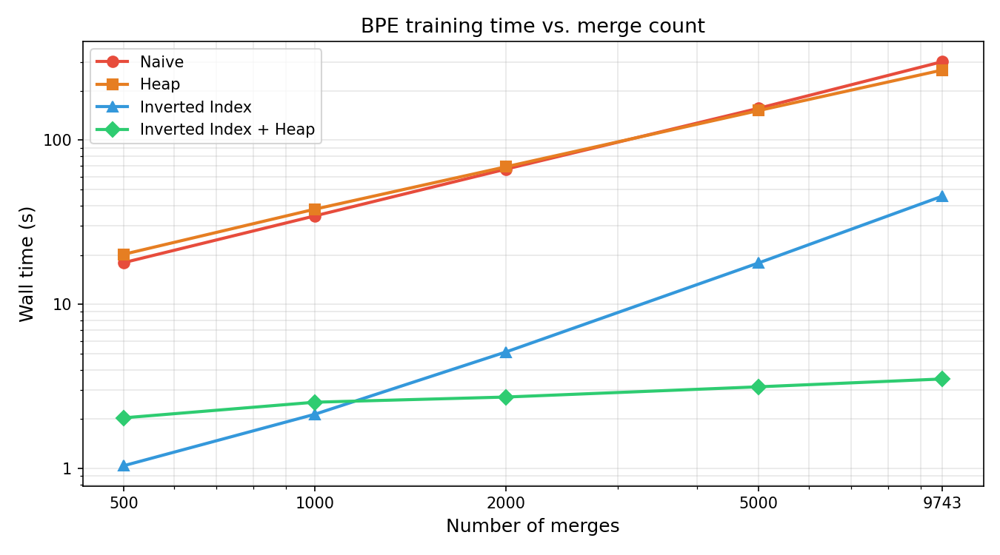
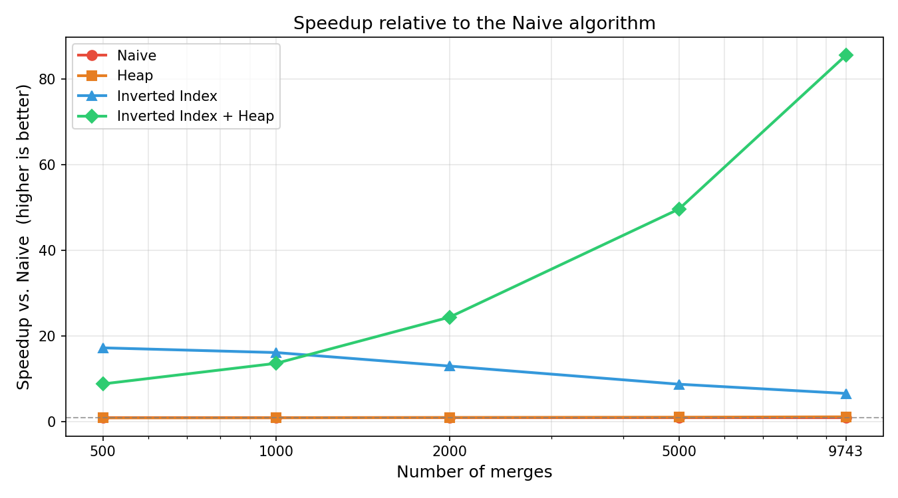
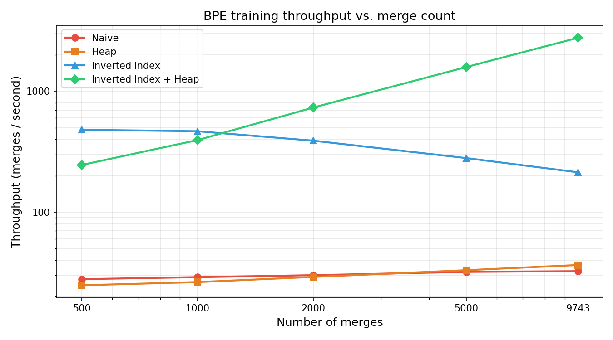

# BPETokenizer

A from-scratch implementation of Byte Pair Encoding (BPE) tokenization in Python, featuring four progressively optimised training algorithms.

Trained on the full [TinyStories](https://huggingface.co/datasets/roneneldan/TinyStories) corpus (2.1 GB, 15.6 M lines). The fastest algorithm (**Inverted Index + Heap**) trains a 10 000-token vocabulary in **3.5 seconds** — an **85×** speedup over the naive baseline.

---

## Algorithms

Each version fixes one bottleneck of the previous one, making the optimisation story concrete and measurable.

| # | Algorithm | Best-pair selection | Word scan per step |
|---|---|---|---|
| 1 | **Naive** | `max()` over all pairs — O(P) | All V words |
| 2 | **Heap** | Lazy max-heap — O(log P) | All V words |
| 3 | **Inverted Index** | `max()` — O(P) | Only words containing the pair |
| 4 | **Inverted Index + Heap** | Lazy max-heap — O(log P) | Only words containing the pair |

> **Python ≥ 3.12 note** — `heapq.heapify_max` / `heappop_max` / `heappush_max` were added as public API in Python 3.13. `bpetokenizer/_heap_compat.py` provides a transparent shim for Python 3.12 using value negation on a standard min-heap.

---

## Benchmark

Corpus: TinyStories training set — 59 921 unique word types after GPT-2 pre-tokenisation.
Hardware: Apple M-series (single core, no multiprocessing during training).

### Wall time

| Merges | Naive | Heap | Inverted Index | **Inv. Index + Heap** |
|-------:|------:|-----:|---------------:|----------------------:|
| 500 | 17.97 s | 20.20 s | 1.04 s | **2.04 s** |
| 1 000 | 34.59 s | 38.01 s | 2.14 s | **2.54 s** |
| 2 000 | 66.64 s | 68.87 s | 5.13 s | **2.73 s** |
| 5 000 | 156.40 s | 151.46 s | 17.88 s | **3.15 s** |
| 9 743 | 300.80 s | 267.48 s | 45.64 s | **3.51 s** |

### Speedup vs. Naive

| Merges | Naive | Heap | Inverted Index | **Inv. Index + Heap** |
|-------:|------:|-----:|---------------:|----------------------:|
| 500 | 1.0× | 0.9× | 17.2× | **8.8×** |
| 1 000 | 1.0× | 0.9× | 16.1× | **13.6×** |
| 2 000 | 1.0× | 1.0× | 13.0× | **24.4×** |
| 5 000 | 1.0× | 1.0× | 8.7× | **49.7×** |
| 9 743 | 1.0× | 1.1× | 6.6× | **85.6×** |

### Throughput (merges / second)

| Merges | Naive | Heap | Inverted Index | **Inv. Index + Heap** |
|-------:|------:|-----:|---------------:|----------------------:|
| 500 | 28 | 25 | 480 | **245** |
| 1 000 | 29 | 26 | 467 | **394** |
| 2 000 | 30 | 29 | 390 | **733** |
| 5 000 | 32 | 33 | 280 | **1 588** |
| 9 743 | 32 | 36 | 213 | **2 773** |

### Plots

<table>
<tr>
<td></td>
<td></td>
</tr>
<tr>
<td align="center"><em>Wall time (log–log scale)</em></td>
<td align="center"><em>Speedup vs. Naive</em></td>
</tr>
</table>

<p align="center">

<br/><em>Throughput (merges / second, log–log scale)</em>
</p>

### Key findings

- **Heap ≈ Naive.** The heap only accelerates best-pair selection, which is not the bottleneck. The dominant cost is scanning all V = 59 921 word types every step; adding a heap even adds slight overhead at low merge counts. The two curves are nearly identical throughout.
- **Inverted Index scales sub-linearly.** By restricting the word scan to only those words containing the merged pair, each step becomes much cheaper. However, throughput *decreases* with more merges because early high-frequency merges touch many words, and the max() scan over all pairs still costs O(P).
- **Inverted Index + Heap compounds both gains.** Throughput *increases* with more merges — opposite to every other algorithm. As the vocabulary grows, pairs become sparser (fewer words per pair → faster index scan) and the heap's O(log P) lookup dominates over O(P) max(). The result is an **85× speedup** at full vocabulary size, with a throughput of 2 773 merges/sec vs. 32 merges/sec for Naive.

---

## Installation

Requires Python ≥ 3.12 and [uv](https://docs.astral.sh/uv/).

```bash
git clone https://github.com/giacolees/BPETokenizer.git
cd BPETokenizer
uv sync
```

## Quick start

```python
from bpetokenizer import Tokenizer, train_bpe

# Train on any UTF-8 text corpus
tokens, merges = train_bpe("corpus.txt", vocab_size=10_000, special_tokens=["<|endoftext|>"])

# Encode and decode
tokenizer = Tokenizer(tokens, merges, special_tokens=["<|endoftext|>"])
ids = tokenizer.encode("Hello, world! <|endoftext|>")
assert tokenizer.decode(ids) == "Hello, world! <|endoftext|>"

# Memory-efficient encoding of large files
with open("corpus.txt") as f:
    for token_id in tokenizer.encode_iterable(f):
        ...
```

## Scripts

```bash
# Pre-tokenize a large corpus in parallel (saves word-frequency counts)
uv run python scripts/pretokenize_corpus.py \
    data/corpus.txt data/counts.pkl \
    --special-tokens "<|endoftext|>" --num-processes 16

# Train and export to JSON for a web demo
uv run python scripts/export_json.py corpus.txt 2000 tokenizer.json

# Re-run the benchmark (results cached in data/benchmark_cache.json)
uv run python benchmark.py
```

## Development

```bash
uv sync --extra dev
uv run pytest tests/ -v
uv run ruff check .
uv run ruff format .
```

## Project structure

```
bpetokenizer/           # installable package
├── __init__.py         # public API: Tokenizer, train_bpe
├── tokenizer.py        # Tokenizer class (encode / decode)
├── train.py            # train_bpe() pipeline
├── pretokenize.py      # GPT-2 regex pre-tokenization + parallel helpers
├── _utils.py           # vocab initialisation and model persistence
├── _constants.py       # BASE_VOCAB_SIZE = 256
├── _heap_compat.py     # max-heap shim for Python 3.12
└── algorithms/
    ├── naive.py
    ├── heap.py
    ├── indexed.py
    └── indexed_heap.py
assets/                 # benchmark plots
scripts/                # CLI entry points
tests/                  # pytest suite
benchmark.py            # algorithm comparison (generates assets/)
```

## How it works

**Pre-tokenization** splits raw text on special tokens, then applies the GPT-2 Unicode-aware regex to produce a `Counter` of word-string frequencies.

**Initialisation** seeds a vocabulary table with 256 single-byte entries (one per possible byte value), appends special tokens at IDs 256+, and builds `pair_counts` (aggregate bigram frequencies) and `pair_to_words` (inverted index: bigram → set of words containing it).

**Training** runs `vocab_size − 256 − len(special_tokens)` iterations. Each iteration picks the highest-frequency bigram, creates a new token whose bytes are the concatenation of the two parents, and updates `pair_counts` and `pair_to_words` in place.

**Inference** (`Tokenizer.encode`) splits on special tokens, applies the GPT-2 regex, then BPE-encodes each chunk greedily by merge rank.
